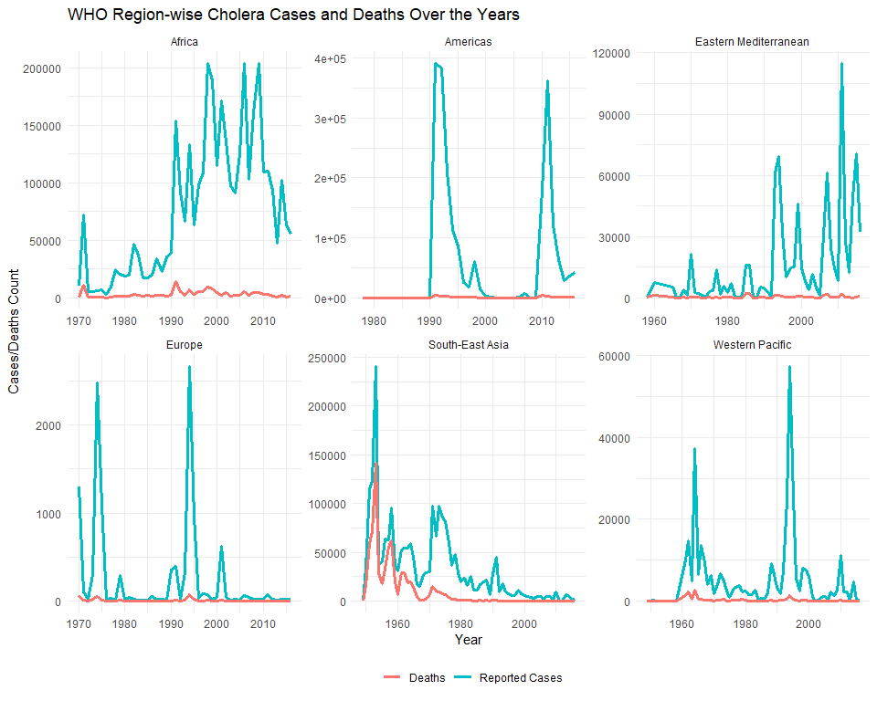
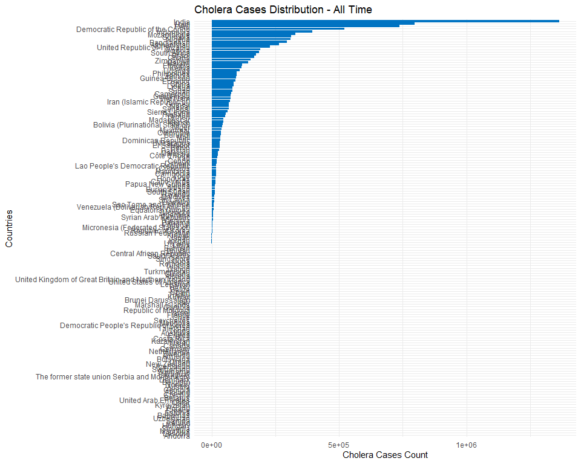
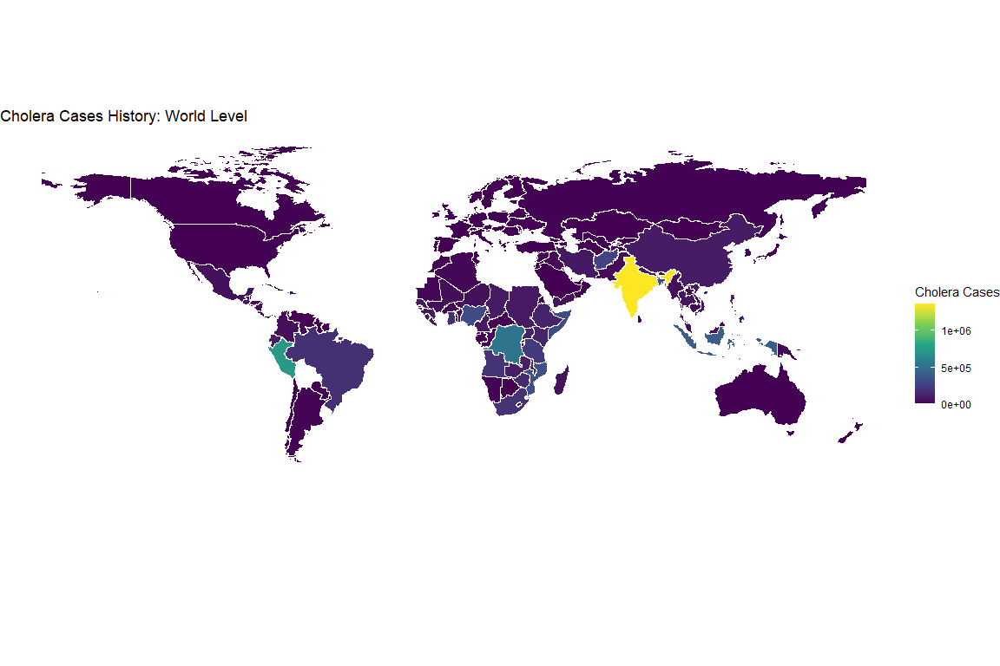
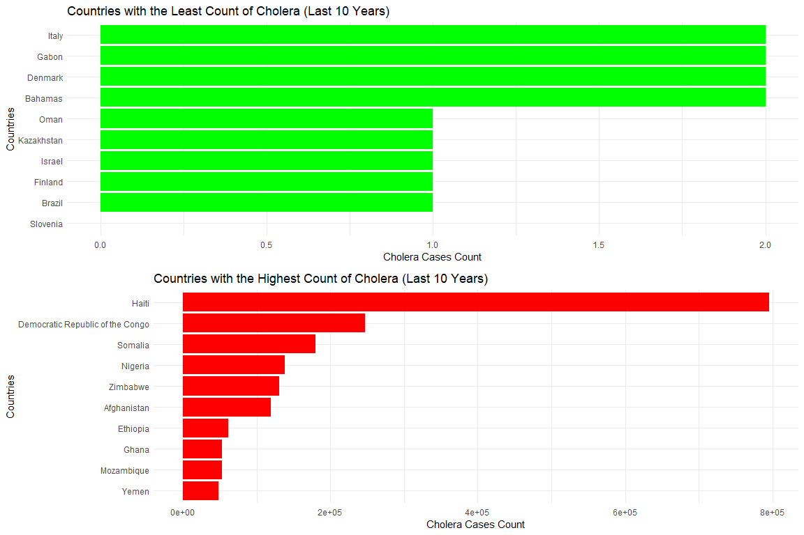
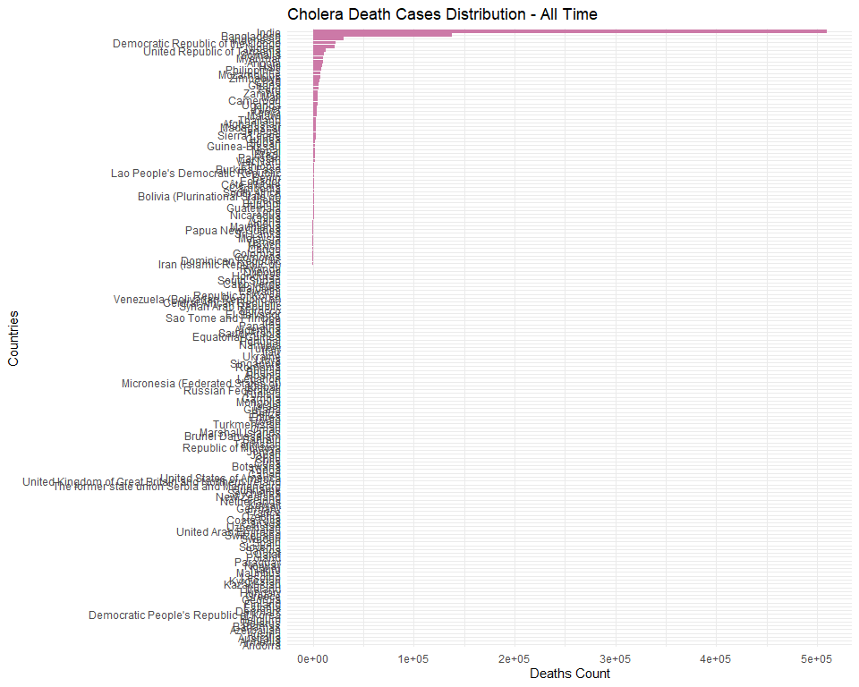
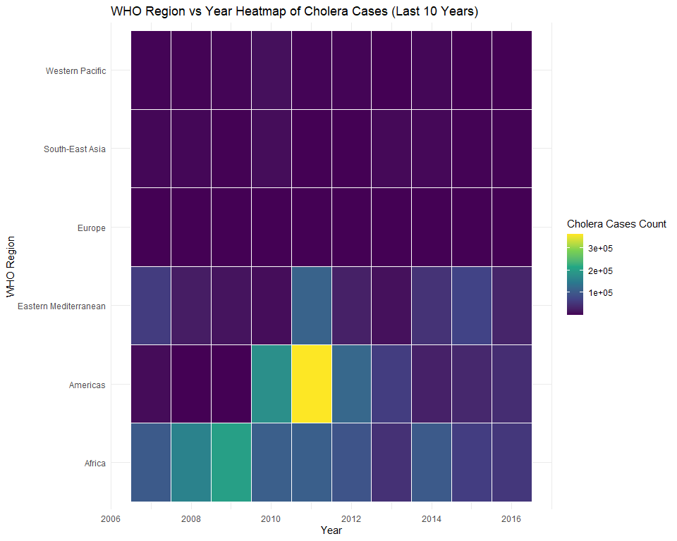
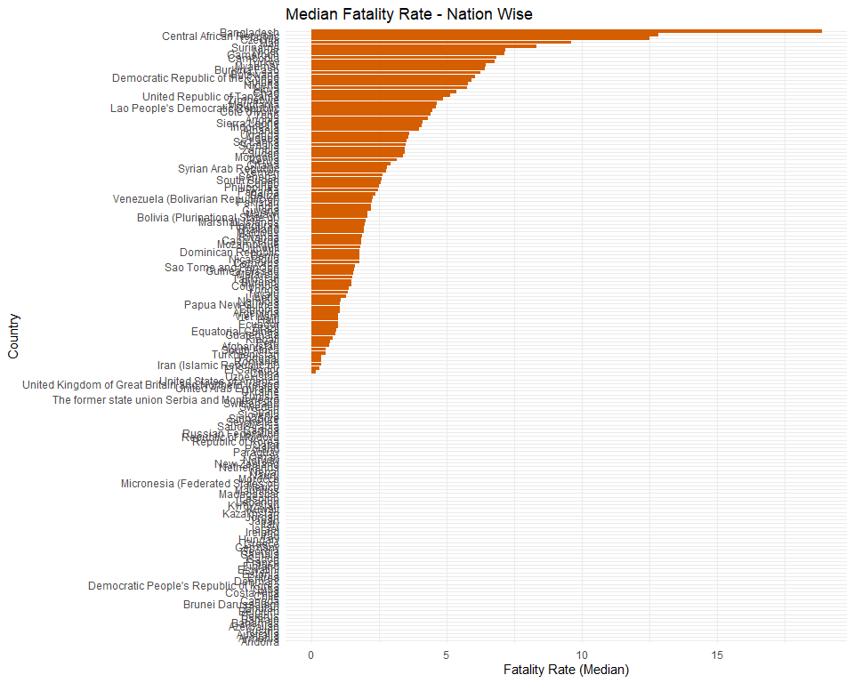

WHO Cholera Analysis
================
Islam Asal
Dec 23, 2023

``` r
knitr::opts_chunk$set(fig.path='Figs/')
```

## 1. Loading Required Libraries

We start by loading essential libraries for data manipulation,
visualization, and handling spatial data.

``` r
library(tidyverse)
library(sf)
library(ggrepel)
library(cowplot)
```

## 2. Reading the Dataset

Next, we load the dataset containing cholera-related data and preview
the first few rows.

``` r
df <- read_csv("cholera.csv")
```

    ## Warning: One or more parsing issues, call `problems()` on your data frame for details,
    ## e.g.:
    ##   dat <- vroom(...)
    ##   problems(dat)

    ## Rows: 2492 Columns: 6
    ## -- Column specification --------------------------------------------------------
    ## Delimiter: ","
    ## chr (2): Country, WHO Region
    ## dbl (4): Year, Number of reported cases of cholera, Number of reported death...
    ## 
    ## i Use `spec()` to retrieve the full column specification for this data.
    ## i Specify the column types or set `show_col_types = FALSE` to quiet this message.

``` r
head(df)
```

    ## # A tibble: 6 x 6
    ##   Country      Year `Number of reported cases of cholera` Number of reported d~1
    ##   <chr>       <dbl>                                 <dbl>                  <dbl>
    ## 1 Afghanistan  2016                                   677                      5
    ## 2 Afghanistan  2015                                 58064                      8
    ## 3 Afghanistan  2014                                 45481                      4
    ## 4 Afghanistan  2013                                  3957                     14
    ## 5 Afghanistan  2012                                    12                      0
    ## 6 Afghanistan  2011                                  3733                     44
    ## # i abbreviated name: 1: `Number of reported deaths from cholera`
    ## # i 2 more variables: `Cholera case fatality rate` <dbl>, `WHO Region` <chr>

## 3. Identifying Data Types

It’s important to inspect the data types of each column to ensure
they’re appropriate for analysis.

``` r
glimpse(df)
```

    ## Rows: 2,492
    ## Columns: 6
    ## $ Country                                  <chr> "Afghanistan", "Afghanistan",~
    ## $ Year                                     <dbl> 2016, 2015, 2014, 2013, 2012,~
    ## $ `Number of reported cases of cholera`    <dbl> 677, 58064, 45481, 3957, 12, ~
    ## $ `Number of reported deaths from cholera` <dbl> 5, 8, 4, 14, 0, 44, 10, 11, 2~
    ## $ `Cholera case fatality rate`             <dbl> 0.70, 0.01, 0.00, 0.35, 0.10,~
    ## $ `WHO Region`                             <chr> "Eastern Mediterranean", "Eas~

## 4. Identifying Missing Values

We check for missing values across the dataset. This helps us decide on
an appropriate cleaning strategy.

``` r
df %>%
  summarise_all(~sum(is.na(.))) %>%
  gather(key = "Column", value = "Missing_Count")
```

    ## # A tibble: 6 x 2
    ##   Column                                 Missing_Count
    ##   <chr>                                          <int>
    ## 1 Country                                            0
    ## 2 Year                                               0
    ## 3 Number of reported cases of cholera               23
    ## 4 Number of reported deaths from cholera           119
    ## 5 Cholera case fatality rate                       129
    ## 6 WHO Region                                         0

## 5. Data Cleaning

Here, we handle missing data by replacing `NA` values and cleaning up
specific entries.

-   `NA` values are replaced with 0.
-   “Unknown” values are replaced with 0.
-   Entries with inconsistent formatting, like `"3 5"`, are corrected.

``` r
df_clean <- df %>%
  mutate(across(everything(), ~replace_na(., 0))) %>%
  mutate(across(contains("cholera"), ~str_replace_all(., "Unknown", "0"))) %>%
  mutate(`Number of reported cases of cholera` = str_replace_all(`Number of reported cases of cholera`, "3 5", "0"),
         `Number of reported deaths from cholera` = str_replace_all(`Number of reported deaths from cholera`, "0 0", "0"),
         `Cholera case fatality rate` = str_replace_all(`Cholera case fatality rate`, "0.0 0.0", "0"))
```

## 6. Unique Countries Count

We calculate the total number of unique countries in the dataset.

``` r
country_list <- unique(df_clean$Country)
length(country_list)
```

    ## [1] 162

## 7. WHO Region-Wise Visualization

We visualize the total number of cholera cases and deaths over the years
for each WHO region. The plot uses different colors for cases and
deaths, and the layout is improved for readability.

``` r
df_clean %>%
  mutate(across(c(`Number of reported cases of cholera`, `Number of reported deaths from cholera`), as.numeric)) %>%
  group_by(`WHO Region`, Year) %>%
  summarise(Reported_Cases = sum(`Number of reported cases of cholera`),
            Deaths = sum(`Number of reported deaths from cholera`)) %>%
  ggplot(aes(x = Year)) +
  geom_line(aes(y = Reported_Cases, color = "Reported Cases"), size = 1.2) +
  geom_line(aes(y = Deaths, color = "Deaths"), size = 1.2) +
  facet_wrap(~`WHO Region`, scales = "free") +
  labs(title = "WHO Region-wise Cholera Cases and Deaths Over the Years", 
       y = "Cases/Deaths Count", color = "") +
  theme_minimal() +
  theme(legend.position = "bottom")
```

    ## `summarise()` has grouped output by 'WHO Region'. You can override using the
    ## `.groups` argument.

<!-- -->

## 8. Country-wise Distribution of Cholera Cases

Here, we plot the distribution of cholera cases by country. The plot is
enhanced with better color schemes and labels for clarity.

``` r
df_clean %>%
  group_by(Country) %>%
  summarise(`Cholera Cases Count` = sum(as.numeric(`Number of reported cases of cholera`))) %>%
  ggplot(aes(x = reorder(Country, `Cholera Cases Count`), y = `Cholera Cases Count`)) +
  geom_col(fill = "#0073C2FF") +
  coord_flip() +
  labs(title = "Cholera Cases Distribution - All Time", 
       x = "Countries", y = "Cholera Cases Count") +
  theme_minimal()
```

<!-- -->

## 9. World Heat Map for Cholera Cases

A global heatmap is plotted to visualize the distribution of cholera
cases across the world.

``` r
map_df <- st_read("TM_WORLD_BORDERS-0.3.shp") %>%
  rename(Country = name) %>%
  mutate(Country = recode(Country, 
                          "Burma" = "Myanmar", 
                          "Korea, Republic of" = "Republic of Korea",
                          "Russia" = "Russian Federation",
                          "United Kingdom" = "United Kingdom of Great Britain and Northern Ireland",
                          "United States" = "United States of America", 
                          "Venezuela" = "Venezuela (Bolivarian Republic of)"))
```

    ## Reading layer `TM_WORLD_BORDERS-0.3' from data source 
    ##   `C:\Users\Esso\Desktop\R_Projects\cholera\TM_WORLD_BORDERS-0.3.shp' 
    ##   using driver `ESRI Shapefile'
    ## Simple feature collection with 246 features and 11 fields
    ## Geometry type: MULTIPOLYGON
    ## Dimension:     XY
    ## Bounding box:  xmin: -180 ymin: -90 xmax: 180 ymax: 83.6236
    ## Geodetic CRS:  WGS 84

``` r
merged <- left_join(map_df, df_clean %>% 
                      group_by(Country) %>% 
                      summarise(`Cholera Cases Count` = sum(as.numeric(`Number of reported cases of cholera`))),
                    by = "Country")

ggplot(merged) +
  geom_sf(aes(fill = `Cholera Cases Count`), color = "white") +
  scale_fill_viridis_c(option = "Blues", na.value = "white", name = "Cholera Cases") +
  labs(title = "Cholera Cases History: World Level") +
  theme_void()
```

    ## Warning in viridisLite::viridis(n, alpha, begin, end, direction, option): Option
    ## 'Blues' does not exist. Defaulting to 'viridis'.

<!-- -->

## 10. Least and Most Affected Countries (Last 10 Years)

We analyze the least and most affected countries by cholera over the
last 10 years. Two separate bar plots are used for better visualization.

``` r
final_10_yrs <- seq(2007, 2016)
ten_yr_case <- df_clean %>% filter(Year %in% final_10_yrs)

file_yr_ctry <- ten_yr_case %>%
  group_by(Country) %>%
  summarise(`Cholera Cases Count` = sum(as.numeric(`Number of reported cases of cholera`)))

best_cases_country <- file_yr_ctry %>% arrange(`Cholera Cases Count`) %>% head(10)
worst_cases_country <- file_yr_ctry %>% arrange(desc(`Cholera Cases Count`)) %>% head(10)

# Plotting Least Affected Countries
p1 <- ggplot(best_cases_country, aes(x = reorder(Country, `Cholera Cases Count`), y = `Cholera Cases Count`)) +
  geom_col(fill = "green") +
  coord_flip() +
  labs(title = "Countries with the Least Count of Cholera (Last 10 Years)",
       x = "Countries", y = "Cholera Cases Count") +
  theme_minimal()

# Plotting Most Affected Countries
p2 <- ggplot(worst_cases_country, aes(x = reorder(Country, `Cholera Cases Count`), y = `Cholera Cases Count`)) +
  geom_col(fill = "red") +
  coord_flip() +
  labs(title = "Countries with the Highest Count of Cholera (Last 10 Years)",
       x = "Countries", y = "Cholera Cases Count") +
  theme_minimal()

cowplot::plot_grid(p1, p2, ncol = 1)
```

<!-- -->

## 11. Country-wise Deaths from Cholera (All Time)

We visualize the distribution of cholera-related deaths across all
countries.

``` r
df_clean %>%
  group_by(Country) %>%
  summarise(`Deaths from Cholera` = sum(as.numeric(`Number of reported deaths from cholera`))) %>%
  ggplot(aes(x = reorder(Country, `Deaths from Cholera`), y = `Deaths from Cholera`)) +
  geom_col(fill = "#CC79A7") +
  coord_flip() +
  labs(title = "Cholera Death Cases Distribution - All Time", 
       x = "Countries", y = "Deaths Count") +
  theme_minimal()
```

<!-- -->

## 12. WHO Region vs Year Heatmap for Cholera Cases (Last 10 Years)

A heatmap visualization is used to show the relationship between WHO
regions and cholera cases over the last 10 years.

``` r
file_yr_region <- ten_yr_case %>%
  group_by(`WHO Region`, Year) %>%
  summarise(`Cholera Cases Count` = sum(as.numeric(`Number of reported cases of cholera`)))
```

    ## `summarise()` has grouped output by 'WHO Region'. You can override using the
    ## `.groups` argument.

``` r
ggplot(file_yr_region, aes(x = Year, y = `WHO Region`, fill = `Cholera Cases Count`)) +
  geom_tile(color = "white") +
  scale_fill_viridis_c(option = "YlOrBr") +
  labs(title = "WHO Region vs Year Heatmap of Cholera Cases (Last 10 Years)", 
       x = "Year", y = "WHO Region") +
  theme_minimal()
```

    ## Warning in viridisLite::viridis(n, alpha, begin, end, direction, option): Option
    ## 'YlOrBr' does not exist. Defaulting to 'viridis'.

<!-- -->

## 13. Country-wise Median Fatality Rate

Finally, we visualize the median fatality rate for cholera across
different countries. This provides insight into the severity of cholera
cases in various regions.

``` r
df_clean %>%
  group_by(Country) %>%
  summarise(`Median Fatality Rate` = median(as.numeric(`Cholera case fatality rate`), na.rm = TRUE)) %>%
  ggplot(aes(x = reorder(Country, `Median Fatality Rate`), y = `Median Fatality Rate`)) +
  geom_col(fill = "#D55E00") +
  coord_flip() +
  labs(title = "Median Fatality Rate - Nation Wise", 
       x = "Country", y = "Fatality Rate (Median)") +
  theme_minimal()
```

<!-- -->
